# Predição e Inteligência Analítica para Alfabetização no Brasil


Projeto desenvolvido para o **Tech Challenge — Fase 3**, com o objetivo de transformar dados públicos educacionais, territoriais e socioeconômicos em inteligência aplicável à alfabetização infantil no Brasil.

A solução utiliza a camada Gold construída na fase anterior, executa análise exploratória, prepara os dados com rastreabilidade, treina e valida modelos supervisionados, identifica alunos sob risco de não alfabetização e consolida os resultados em análises municipais.

> **Classe de interesse:** `0 = aluno não alfabetizado`. As métricas de recall, precisão, F1 e PR-AUC apresentadas para risco referem-se a essa classe.

## 1. Problema e objetivo analítico

A alfabetização infantil é um indicador central do desenvolvimento educacional. Entretanto, observar apenas resultados consolidados não permite antecipar vulnerabilidades nem priorizar intervenções.

O projeto responde a três necessidades:

1. prever se um aluno será alfabetizado ou não alfabetizado;
2. identificar fatores associados às previsões do modelo;
3. transformar probabilidades individuais em inteligência territorial para apoiar gestores públicos.

O modelo deve funcionar como **instrumento de apoio à priorização**, e não como decisão automática sobre alunos, escolas ou municípios.

## 2. Fontes e base analítica

A base final integra dados provenientes de:

- Indicador Criança Alfabetizada;
- Atlas do Desenvolvimento Humano;
- Censo Escolar;
- Fundeb;
- indicadores e metas educacionais municipais;
- informações territoriais e socioeconômicas.

Após a engenharia de dados, a base Gold contém **1.966.605 registros e 41 variáveis**. A etapa de preparação selecionou **16 features preditivas**, mantendo identificadores somente para rastreabilidade, agrupamento e auditoria.

Entrada oficial da Fase 3:

```text
/Volumes/workspace/default/vol_trio_drive/
└── projetos/
    └── fiap/
        └── tech_challenge_fase2/
            └── gold/
                └── alunos_base_enriquecida_finalizada/
                    └── base_analitica_final.csv
```

Todos os artefatos analíticos e de Machine Learning são gravados em:

```text
/Volumes/workspace/default/vol_trio_drive/
└── projetos/
    └── fiap/
        └── tech_challenge_fase3/
```

## 3. Arquitetura da solução

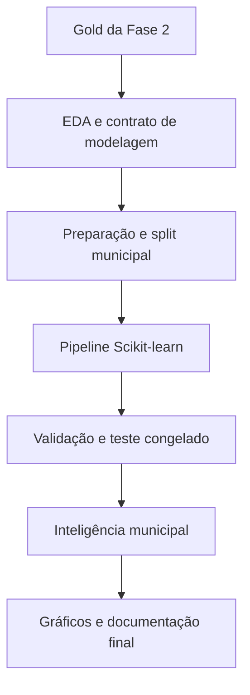

O pré-processamento é incorporado diretamente às pipelines. Dessa forma, imputação, transformação, encoding e modelo seguem como uma única unidade reproduzível, reduzindo risco de divergência entre treinamento e inferência.

## 4. Organização dos notebooks

| Notebook | Responsabilidade |
|---|---|
| `00_setup_ambiente_AWS_S3.ipynb` | Configuração do ambiente, S3 e Unity Catalog Volume |
| `01_merge_alunos_atlas.ipynb` | Integração da base de alunos com o Atlas |
| `02_merge_alunos_atlas_censo.ipynb` | Inclusão das informações do Censo Escolar |
| `03_merge_alunos_atlas_censo_fundeb.ipynb` | Inclusão dos dados do Fundeb |
| `04_merge_alunos_atlas_censo_fundeb_indicadores.ipynb` | Inclusão de metas e indicadores educacionais |
| `05_base_enriquecida_pronta.ipynb` | Validação e persistência da base Gold final |
| `06_eda_entendimento_modelagem.ipynb` | EDA, hipóteses, leakage e contrato de modelagem |
| `07_preparacao_para_modelagem_rastreabilidade_databricks.ipynb` | Seleção de features, split agrupado e bases preditivas |
| `08_modelagem_e_validacao_rastreabilidade_databricks.ipynb` | Baselines, tuning, limiar, teste, interpretabilidade e rastreabilidade |
| `09_aplicacao_estrategica_e_inteligencia_educacional.ipynb` | Ranking, gap de meta e clusters municipais |
| `10_consolidacao_graficos_finais_databricks.ipynb` | Consolidação dos gráficos oficiais da entrega |

## 5. Preparação e prevenção de leakage

As decisões centrais da preparação foram:

- remoção de identificadores das features do modelo;
- separação do target `in_alfabetizado`;
- seleção das 16 features após a EDA;
- imputação de variáveis numéricas dentro da pipeline;
- tratamento de variáveis categóricas dentro da pipeline;
- engenharia de atributos centralizada em `src/preprocessing.py`;
- divisão de treino, validação e teste por município;
- ajuste de transformadores somente nos dados de treinamento;
- uso do teste uma única vez, após congelamento do modelo e do limiar.

A divisão agrupada reduz o otimismo que ocorreria se registros do mesmo município — com contexto territorial repetido — fossem distribuídos entre treino e teste.

| Conjunto | Registros | Finalidade |
|---|---:|---|
| Treino | 1.303.743 | Ajuste dos modelos e das transformações |
| Validação | 363.471 | Seleção de modelo, hiperparâmetros e limiar |
| Teste | 298.881 | Avaliação final fora da amostra |

O teste contém **834 municípios** não utilizados no treinamento ou na seleção do modelo.

## 6. Modelos avaliados

Foram construídas e comparadas as seguintes famílias:

- `DummyClassifier`, como baseline ingênuo;
- `LogisticRegression`, como referência linear interpretável;
- `RandomForestClassifier`, para relações não lineares e interações;
- `HistGradientBoostingClassifier`, para boosting eficiente em uma base extensa.

O modelo selecionado na validação foi o **HistGradientBoostingClassifier balanceado**, após comparação por PR-AUC da classe 0, otimização de hiperparâmetros e análise de limiar.

O limiar foi congelado em **0,50**. A escolha realizada na validação não foi modificada após o acesso ao conjunto de teste.

## 7. Resultados reais no teste

| Métrica | Resultado |
|---|---:|
| Acurácia | 0,6152 |
| Acurácia balanceada | 0,6179 |
| Recall — não alfabetizado | 0,6262 |
| Precisão — não alfabetizado | 0,4469 |
| F1 — não alfabetizado | 0,5216 |
| PR-AUC — não alfabetizado | 0,4710 |
| ROC-AUC — não alfabetizado | 0,6611 |
| Brier Score | 0,2282 |

Matriz de confusão, considerando `0 = não alfabetizado` como classe de interesse:

| Resultado | Quantidade |
|---|---:|
| Verdadeiros positivos da classe 0 | 62.699 |
| Falsos negativos da classe 0 | 37.430 |
| Falsos positivos da classe 0 | 77.590 |
| Verdadeiros negativos da classe 0 | 121.162 |

Os intervalos de confiança de 95% foram calculados por bootstrap municipal:

| Métrica | IC 95% |
|---|---:|
| Recall — não alfabetizado | 0,5319 a 0,7187 |
| Precisão — não alfabetizado | 0,4290 a 0,4676 |
| F1 — não alfabetizado | 0,4815 a 0,5597 |
| Acurácia balanceada | 0,6040 a 0,6339 |
| PR-AUC — não alfabetizado | 0,4404 a 0,4985 |
| ROC-AUC — não alfabetizado | 0,6457 a 0,6793 |

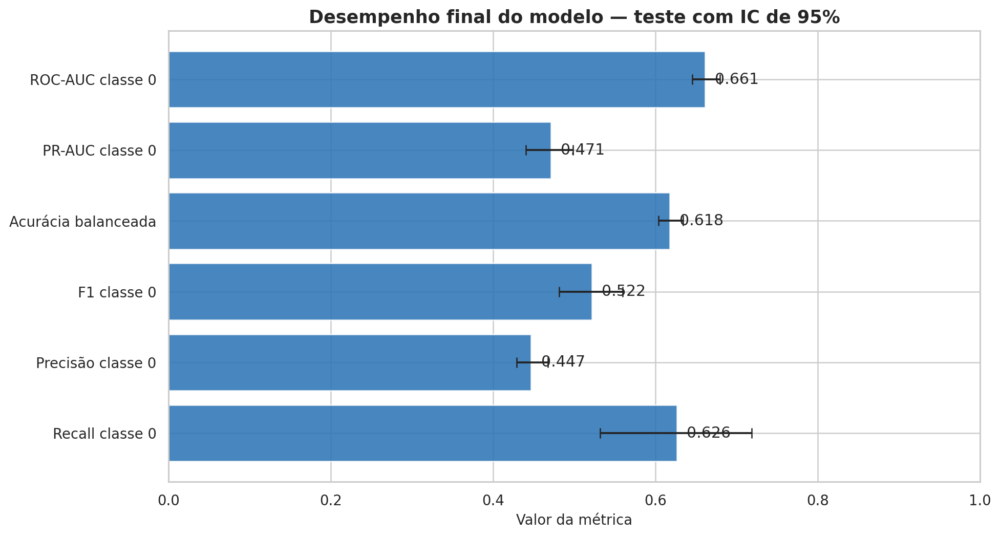

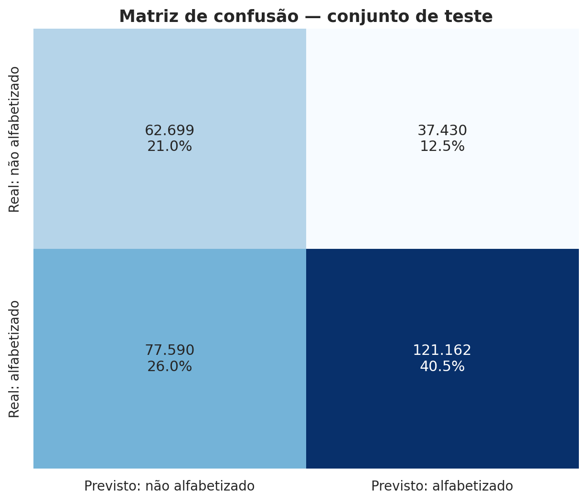

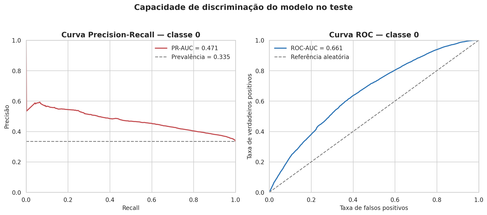

## 8. Limiar e capacidade de generalização

Na validação, o modelo apresentou recall de **71,27%** para a classe não alfabetizada. No teste, o recall foi de **62,62%**, uma redução de aproximadamente **8,65 pontos percentuais**.

Portanto, a restrição de recall mínimo de 70% usada durante o desenvolvimento **não se manteve no teste**. O limiar não foi recalibrado com o teste, pois isso transformaria o conjunto final em uma nova base de validação e comprometeria a estimativa de generalização.

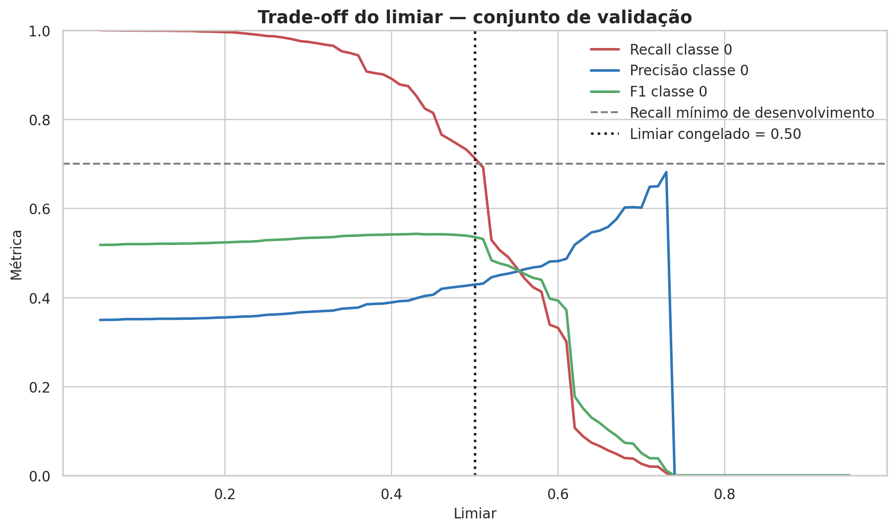

## 9. Interpretabilidade

A influência global das variáveis foi avaliada por importância de permutação, medindo a redução da PR-AUC após o embaralhamento de cada feature. O procedimento considera a pipeline completa e mantém a interpretação no nível das 16 variáveis de entrada.

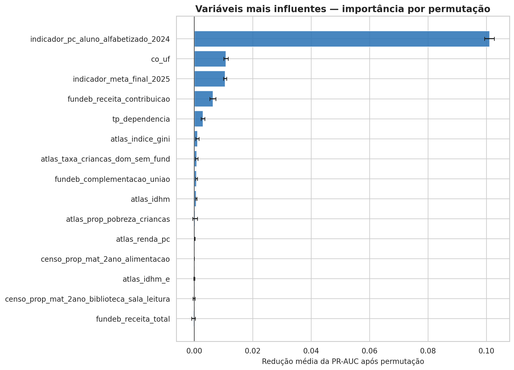

Essas importâncias representam **associação preditiva**, não efeito causal. Uma variável importante para o modelo não deve ser interpretada isoladamente como causa da alfabetização ou da não alfabetização.

## 10. Estabilidade territorial

O desempenho apresentou forte heterogeneidade entre regiões:

| Região | Recall da classe 0 |
|---|---:|
| Norte | 89,82% |
| Nordeste | 77,16% |
| Sul | 56,94% |
| Sudeste | 53,65% |
| Centro-Oeste | 9,62% |

A amplitude regional do recall é de aproximadamente **80,19 pontos percentuais**. No recorte por UF, Acre, Ceará, Espírito Santo, Paraná e Goiás apresentaram recall igual a zero no teste observado.

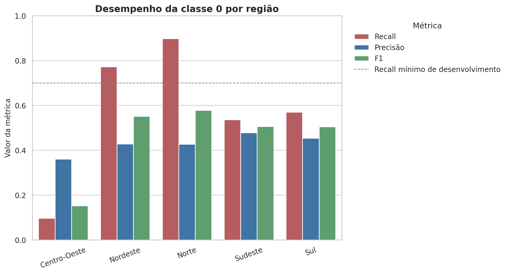

Esses resultados impedem recomendar o modelo para implantação nacional automática. Antes de uso operacional, são necessárias investigação de representatividade, calibração territorial e nova validação prospectiva.

## 11. Aplicação estratégica municipal

As probabilidades individuais foram agregadas por município para produzir:

- ranking de risco médio previsto;
- taxa estimada de alfabetização;
- gap previsto em relação à meta municipal;
- volume de alertas e falsos negativos;
- perfis municipais semelhantes por clusterização.

Para aumentar a estabilidade, os rankings consideram municípios com pelo menos 100 alunos no conjunto de teste.

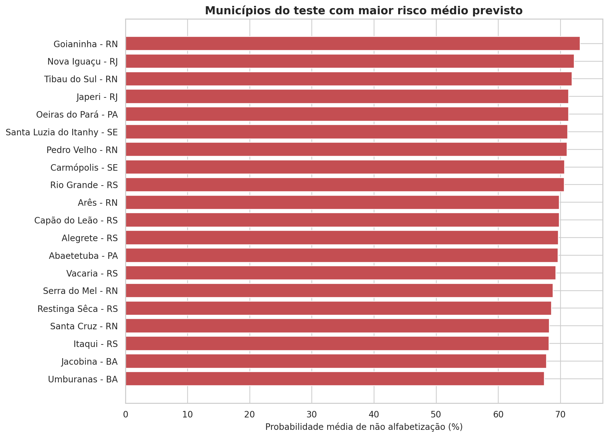

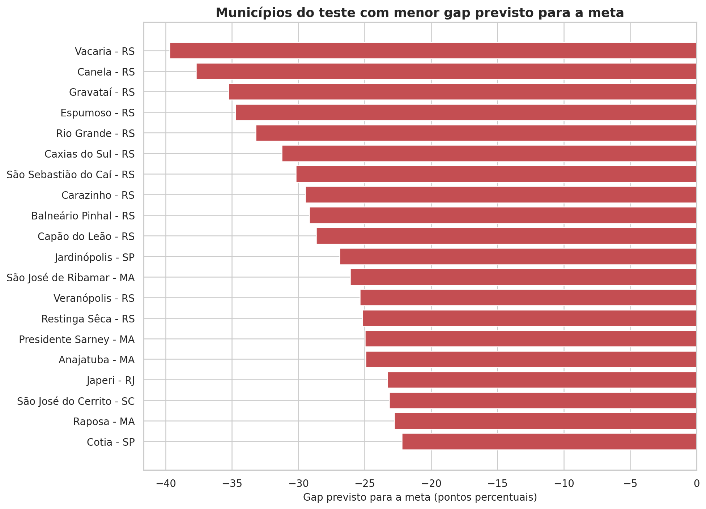

O número de clusters foi escolhido entre 2 e 8 pelo maior silhouette score. Imputação e padronização foram incorporadas à pipeline de clusterização, e os identificadores arbitrários do KMeans foram reordenados pela probabilidade média de risco.

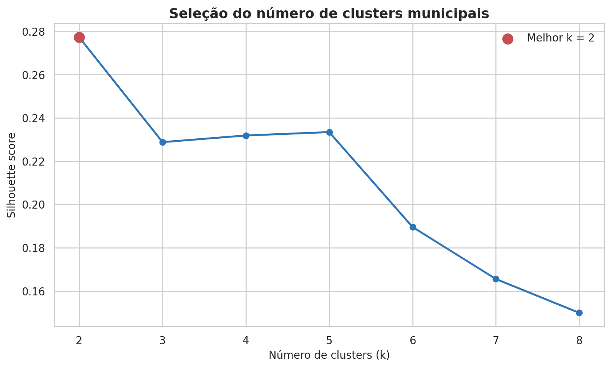

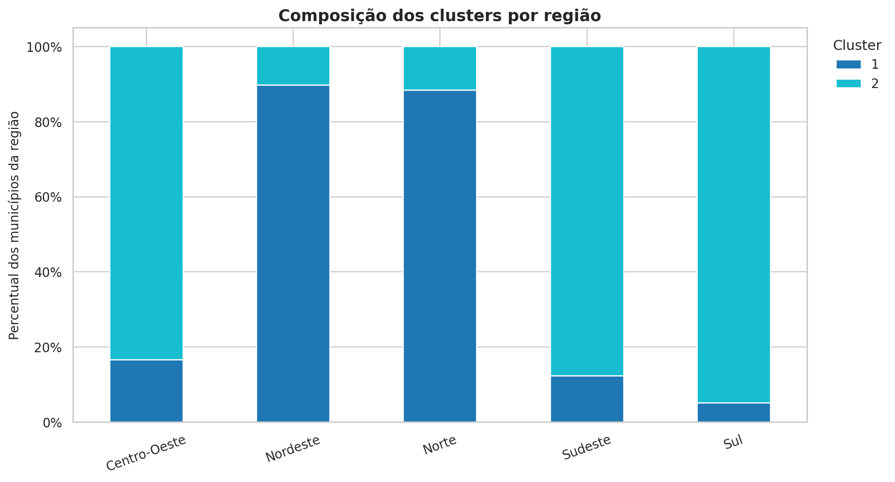

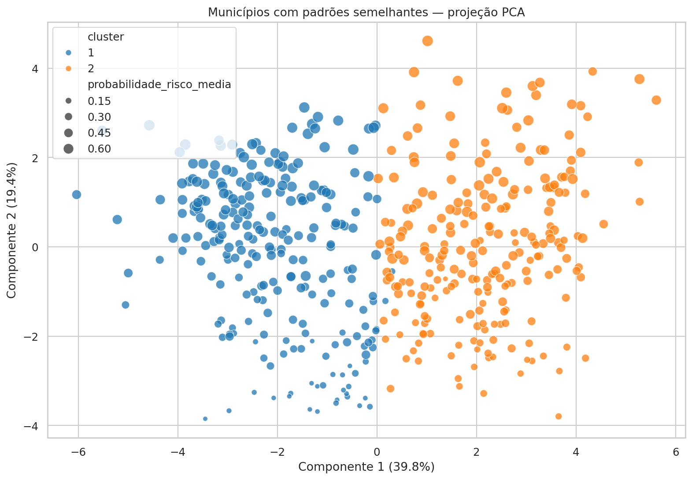

## 12. Limitações reais

1. **Queda de recall:** o recall mínimo de desenvolvimento não se manteve no teste.
2. **Instabilidade territorial:** existem diferenças relevantes entre regiões e UFs.
3. **Cobertura da aplicação:** o ranking municipal representa os 834 municípios do teste, não todos os municípios brasileiros.
4. **Dados contextuais repetidos:** várias features são municipais e aparecem para muitos alunos; por isso, a validação agrupada é obrigatória.
5. **Defasagem temporal:** fontes externas podem representar períodos diferentes e não capturar mudanças recentes.
6. **Missingness territorial:** ausências não são necessariamente aleatórias e podem refletir desigualdade de cobertura das fontes.
7. **Probabilidade não causal:** previsões e importâncias não demonstram que uma variável causa o resultado educacional.
8. **Risco de viés:** diferenças de representação territorial podem produzir desempenho desigual entre populações.
9. **Limiar operacional:** o limiar de 0,50 depende do custo atribuído a falsos negativos e falsos positivos.
10. **Sem validação prospectiva:** o estudo utiliza uma divisão da base histórica; ainda não existe avaliação com dados futuros coletados após a implantação.
11. **Interpretabilidade sem SHAP Values:** o projeto utilizou importância por permutação para interpretação global, mas ainda não aplicou SHAP Values para avaliar a direção e a magnitude das contribuições das variáveis nas previsões globais e individuais.

## 13. Uso responsável

O modelo pode apoiar:

- priorização de territórios para análise humana;
- planejamento de ações de reforço;
- acompanhamento de municípios com risco de não atingir metas;
- investigação de fatores educacionais e socioeconômicos;
- distribuição preliminar de atenção e recursos.

O modelo não deve ser usado isoladamente para punir, excluir, rotular ou reduzir investimentos de alunos, escolas, profissionais ou municípios. Toda decisão deve combinar evidência quantitativa, conhecimento local e supervisão humana.

## 14. Estrutura recomendada do repositório

```text
├── presentation
│   └── tc3 - Ellen Paulo e Tiago apresentação executiva.mp4
│   └── 00 - Da base gold à aplicação estratégica.jpg
│   └── 12 - principais pontos de atenção.jpg
│   └── 13 - pull request.jpg
│   └── 14 - Main completa.jpg
├── artifacts
│   └── feature_schema.json
│   └── model_metadata.json
│   └── model_pipeline.joblib
├── config
│   └── paths.example.py
├── docs
│   ├── enunciado
│   │   └── [IAST] - Tech Challenge - Fase 3.pdf
│   ├── guias
│   │   ├── guia_eda_tech_challenge_fase3.docx
│   │   └── guia_modelagem_tech_challenge_fase3.docx
│   ├── model_card
│   │   └── MODEL_CARD.md
│   └── resumos
│       ├── resumo_construcao_base_enriquecida_tech_challenge.docx
│       ├── resumo_construcao_eda_tech_challenge_fase3.docx
│       ├── resumo_construcao_modelagem_note07e08.docx
│       ├── resumo_construcao_notebook09_aplicacao_estrategica.docx
│       └── resumo_construcao_notebook10_consolidacao_graficos_finais.docx
├── images
│   └── finais
│       ├── 01_metricas_finais_ic95.png
│       ├── 02_matriz_confusao_teste.png
│       ├── 03_curvas_pr_roc_teste.png
│       ├── 04_tradeoff_limiar_validacao.png
│       ├── 05_importancia_permutacao_top15.png
│       ├── 06_metricas_por_regiao.png
│       ├── 07_top20_risco_municipal.png
│       ├── 08_top20_gap_meta.png
│       ├── 09_selecao_numero_clusters.png
│       ├── 10_clusters_por_regiao.png
│       └── 11_clusters_municipais_pca.png
├── notebooks
│   ├── 00_setup_ambiente_AWS_S3_Fase3.ipynb
│   ├── 01_merge_alunos_atlas.ipynb
│   ├── 02_merge_alunos_atlas_censo.ipynb
│   ├── 03_merge_alunos_atlas_censo_fundeb.ipynb
│   ├── 04_merge_alunos_atlas_censo_fundeb_indicadores.ipynb
│   ├── 05_base_enriquecida_pronta.ipynb
│   ├── 06_eda_entendimento_modelagem.ipynb
│   ├── 07_preparacao_para_modelagem_rastreabilidade_databricks (1).ipynb
│   ├── 08_modelagem_e_validacao_rastreabilidade_databricks.ipynb
│   ├── 09_aplicacao_estrategica_e_inteligencia_educacional.ipynb
│   └── 10_consolidacao_graficos_finais_databricks.ipynb
├── reports
│   ├── aplicacao_estrategica
│   │   ├── avaliacao_k_clusters.csv
│   │   ├── distribuicao_clusters_regiao.csv
│   │   ├── municipios_clusters.csv
│   │   ├── municipios_risco_meta.csv
│   │   ├── painel_municipal_teste.csv
│   │   ├── perfil_clusters.csv
│   │   ├── ranking_municipal_risco.csv
│   │   └── resumo_executivo_aplicacao.csv
│   ├── consolidacao_visual
│   │   └── manifesto_imagens_finais.csv
│   └── modelagem
│       ├── comparacao_estatistica_otimizada.csv
│       ├── diagnostico_generalizacao.csv
│       ├── importancia_permutacao.csv
│       ├── intervalos_confianca.csv
│       ├── metricas_por_dependencia.csv
│       ├── metricas_por_regiao.csv
│       ├── metricas_por_uf.csv
│       ├── metricas_teste_final.csv
│       ├── previsoes_teste_rastreaveis.parquet
│       └── resultados_bootstrap.parquet
├── src
│   ├── __pycache__
│   │   ├── __init__.cpython-312.pyc
│   │   └── preprocessing.cpython-312.pyc
│   ├── __init__.py
│   └── preprocessing.py
├── tests
│   ├── __init__.py
│   ├── test_data_contracts.py
│   └── test_preprocessing.py
├── _.gitignore
├── README.md
└── requirements.txt
```

Arquivos pesados permanecem no S3/Unity Catalog Volume. O Git deve armazenar código, notebooks, documentação, relatórios leves e as imagens finais selecionadas.

## 15. Instalação e execução

### Databricks

1. disponibilize `src/preprocessing.py` diretamente em:

   ```text
   /Volumes/workspace/default/vol_trio_drive/
   projetos/fiap/tech_challenge_fase3/src/
   ```

2. utilize um Databricks Runtime compatível com Python 3 e `scikit-learn==1.6.1`;
3. instale dependências adicionais no início da sessão, se necessário:

   ```python
   %pip install -r /Workspace/caminho-do-repositorio/requirements.txt
   ```

4. reinicie o Python somente se o Databricks solicitar;
5. execute os notebooks em ordem numérica, de `00` a `10`.

### Ambiente local

```bash
python -m venv .venv
source .venv/bin/activate        # Linux ou macOS
# .venv\Scripts\activate       # Windows
python -m pip install --upgrade pip
pip install -r requirements.txt
```

O ambiente local não reproduz automaticamente `dbutils`, Unity Catalog ou os caminhos `/Volumes`. Essas integrações exigem Databricks ou uma camada local de adaptação.

## 16. Artefatos reproduzíveis

O notebook 08 persiste:

- pipeline completa em `model_pipeline.joblib`;
- metadados e assinatura da configuração;
- schema das features;
- métricas e intervalos de confiança;
- importância por permutação;
- diagnósticos territorial e de generalização;
- previsões rastreáveis do teste;
- Model Card.

O notebook 09 persiste painéis, rankings, gaps e clusters municipais. O notebook 10 gera o manifesto dos 11 gráficos finais.

## 17. Próximas evoluções

- validar o modelo com uma nova coorte temporal;
- aplicar SHAP Values em uma amostra representativa, complementando a importância por permutação com análises globais e individuais das contribuições das variáveis;
- investigar e corrigir a baixa sensibilidade no Centro-Oeste e em UFs críticas;
- testar calibração e limiares definidos por custo em um novo conjunto de validação;
- ampliar a inferência para municípios fora do conjunto de teste;
- implementar monitoramento de drift, calibração e desempenho territorial;
- avaliar estratégias de fairness e modelos hierárquicos ou territoriais;
- publicar dashboard executivo com atualização governada;
- automatizar testes e execução com CI/CD.

## 18. Conclusão

O projeto entregou uma pipeline completa e rastreável de Ciência de Dados: integração da Gold, EDA, prevenção de leakage, modelagem supervisionada, otimização, validação estatística, interpretabilidade e aplicação municipal.

O `HistGradientBoostingClassifier` demonstrou capacidade preditiva superior ao baseline e utilidade como sistema de priorização. Ao mesmo tempo, a queda de recall e a instabilidade territorial mostram que o resultado deve ser tratado como **protótipo analítico validado**, ainda dependente de evolução antes de uma implantação nacional.

O principal valor da solução não é apenas classificar alunos, mas organizar evidências para que gestores investiguem riscos, priorizem territórios e tomem decisões educacionais mais informadas.
